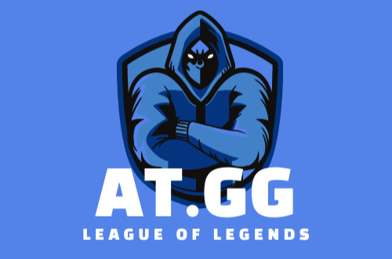
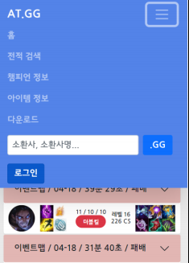
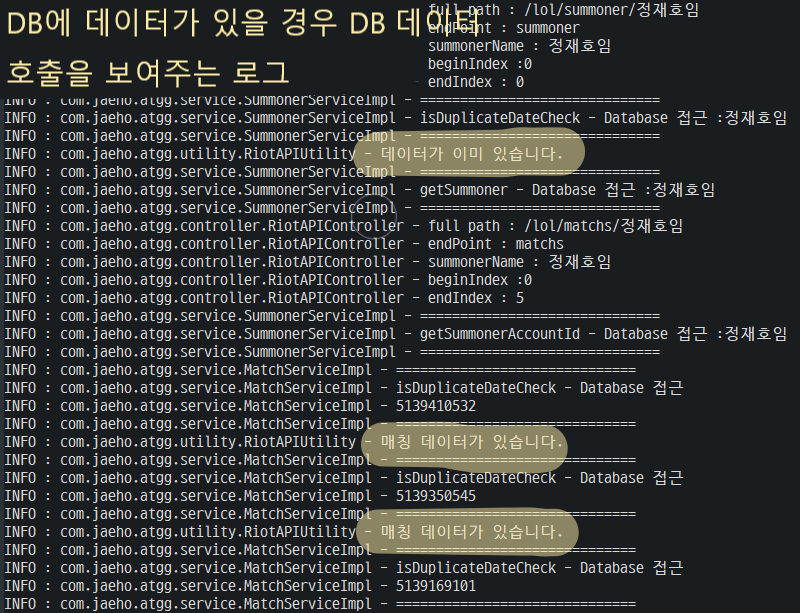
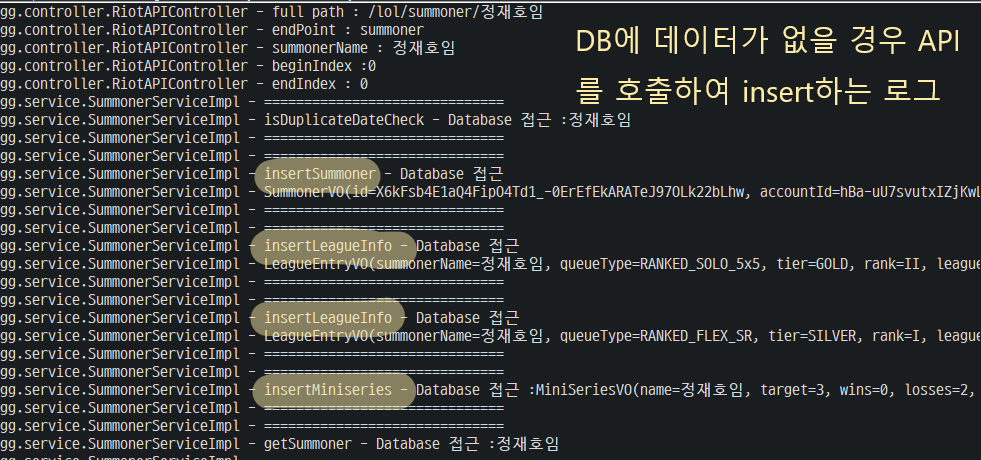
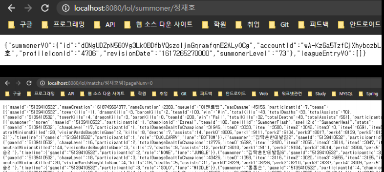

# **AT.GG_Project**
   
Spring 기반 게임 전적 검색 사이트입니다.

---

## **프로젝트 개요**
- 개발 기간 : 21/04/06 ~ 04/20 (14일)
- 개발 인원 : 1명
- 사용 툴  : Eclipse
- 주요 사용 기술
  - Spring, MyBatis, MySQL, Bootstrap

---

## **프로젝트 주요 특징**
- 반응형 웹으로 구성하였습니다. (BootStrap)
- DB관리와 API, Json 데이터를 성형하여 restAPI 형태로 다시 제공하도록 설계했습니다.
- 많은 생성과 삭제가 있는 객체의 경우 풀링, 싱글톤 방식을 사용하여 리소스 소모를 줄일 수 있게 설계했습니다.
- 다량의 API호출을 줄일 수 있도록 DB 검사 로직을 한 클래스에서 관리 할 수 있게 설계했습니다.
- Ajax를 활용하여 부분 새로고침 기능을 구현했습니다.

---

> **반응형 웹**



BootStrap을 활용한 반응형 웹

---

> **프로젝트 최적화**

```java
[RestAPIUtility.class 일부]

// 커넥션 Pool
private static ConnectionPool connectionPool = new ConnectionPool();

// sync client 객체
private static OkHttpClient syncClient;

// async client 객체
private static OkHttpClient asyncClient;

// 동기 클라이언트 객체 싱글톤
private static OkHttpClient getSyncOkHttpClient() {
	if (syncClient == null) {
		syncClient = new OkHttpClient.Builder().connectionPool(connectionPool).build();
	}
	return syncClient;
}

// 비동기 클라이언트 객체 싱글톤
private static OkHttpClient getAsyncOkHttpClient() {
	if (asyncClient == null) {
		asyncClient = new OkHttpClient.Builder().connectionPool(connectionPool).build();
	}
	return asyncClient;
}
```
생성과 삭제가 빈번하게 발생하는 Client 객체(restAPI 통신에 사용 되는 객체)를 풀, 싱글톤으로 관리    

```xml
[ root-context.xml 일부]

<!-- mysql 설정 -->
<bean id="hikariConfig" class="com.zaxxer.hikari.HikariConfig">
	<property name="driverClassName"
		value="net.sf.log4jdbc.sql.jdbcapi.DriverSpy"></property>
	<property name="jdbcUrl"
		value="jdbc:log4jdbc:mysql://127.0.0.1:3306/atgg?characterEncoding=UTF8"></property>
	<property name="username" value="root"></property>
	<property name="password" value="123456"></property>
</bean>

<!-- HikariCP configuration -->
<bean id="dataSource" class="com.zaxxer.hikari.HikariDataSource"
	destroy-method="close">
	<constructor-arg ref="hikariConfig" />
</bean>
<bean id="sqlSessionFactory"
	class="org.mybatis.spring.SqlSessionFactoryBean">
	<property name="dataSource" ref="dataSource"></property>
</bean>
<bean id="transactionManager"
	class="org.springframework.jdbc.datasource.DataSourceTransactionManager">
	<property name="dataSource" ref="dataSource"></property>
</bean>
```
DB Connection 객체 또한 HikariConfig 라이브러리를 사용하여 풀에서 관리

---
> **API 호출 최적화**

<div></div>


게임사(Riot) API를 호출하기 전에 DB에 데이터 유무를 판단합니다.   
데이터가 있다면 DB에 호출 없다면 API를 호출하여 DB에 저장합니다.

---

> **Ajax 통신 무한 스크롤**

```javascript
[ summoner.jsp 일부분 ]

<script>
  var source = $("#template").html();
  var template = Handlebars.compile(source);
  var pageNum = ${ pageNum + 1 };

  $('.match_btn').on('click', function () {
    var html = '';
    var url = '/lol/matchs/${ summoner.name }?pageNum=' + pageNum;
    $.ajax({
      type: 'GET',
      url: url,
      success: function (data) {
        pageNum++;

        // ~~ 중략 ~~

        $("#match_container").append(html);
      },
      error: function () {
        console.log('통신 오류');
      }
    });
    // $('#match_cap').load(window.location.href + ' #match_container');
  });
</script>
```
`handlebars.js`를 활용하여 html 템플릿을 구성했습니다.    
더보기 버튼 클릭 시 게임사(Riot)에서 제공하는 만큼 무한하게 데이터를 받아옵니다.
